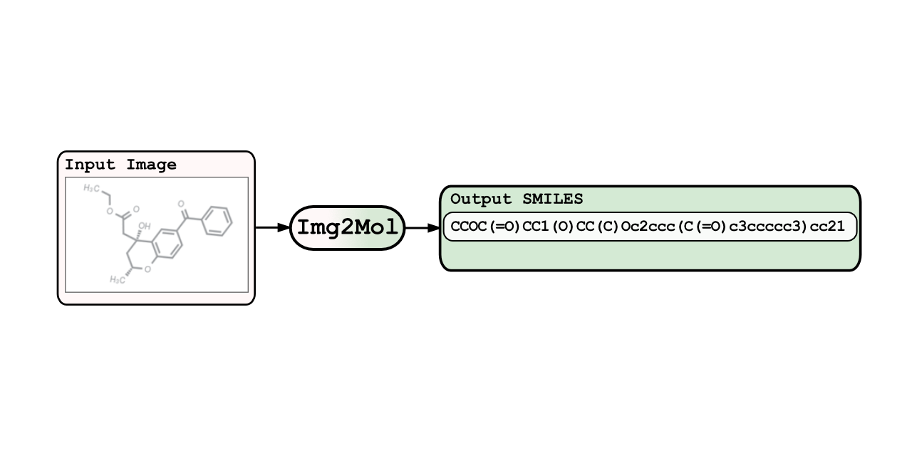

img2mol: inferring molecules from pictures
==========================================

Welcome to img2mol! :wave:.
The model will be publicly available after acceptance of the final manuscript. In the meantime, you are welcome to read our [preprint](https://chemrxiv.org/articles/preprint/Img2Mol_-_Accurate_SMILES_Recognition_from_Molecular_Graphical_Depictions/14320907/1?file=27273986).

## Overview
 Here we provide the implementation of the `img2mol` model using [PyTorch](https://github.com/pytorch/pytorch) and [PyTorch Lightning](https://github.com/PyTorchLightning/pytorch-lightning) for training and inference, along with an exemplary jupyter notebook.
 
This repository is organized as follows:
* `examples/`: contains example images to apply our proposed model on
* `img2mol/`: contains necessary python modules for our proposed model
* `model/`: stores the trained model weights as pickled files. The download-link will be provided in future soon

## Installation
#### Requirements
```
python=3.8.5
pip=20.2.4
notebook=6.4.2
pillow=8.0.1
numpy=1.19.2
rdkit=2020.03.1
cudatoolkit=11.0
torchvision=0.8.0
torchaudio=0.7.0
pytorch=1.7.0
pytorch-lightning=1.0.8
```

#### Environment
Create a new environment:
```bash
git clone git@github.com:bayer-science-for-a-better-life/Img2Mol.git
cd Img2Mol
conda env create -f environment.yml
conda activate img2mol
pip install .
```

## Examples
Check the example notebook `example_inference.ipynb` to see how the inference class can be used.

## Reference
Please cite our manuscript if you use our model in your work. **_tbd_**: add reference
